## Introduction
Here we assess the influence of current and hypothetical simulated future forestry and fire 'disturbance' on caribou habitat in the Mackenzie timber supply area. Caribou are a species of concern to First Nations in the region, and to the governments of British Columbia and Canada. First Nations requested this analysis to assess the potential influence of future forest harvest on caribou as part of the Mackenzie timber supply review.

'Disturbance' is defined here as areas less than 500 m from roads or early seral (less than 40 year old) forestry cutblocks, or areas burned in the last 40 years. These disturbance types have been negatively correlated with caribou survival rates and population abundance across Canada, and therefore are often used to indicate the effects of habitat change caused by forestry and fire on caribou populations. Other disturbance types (e.g., mountain pine beetle infestations or industrial activities like oil and gas or mining development) may also negatively influence caribou, but we do not account for them here. We focus exclusively on fire and forestry because forest management is the scope of the timber supply review and only future forestry and fire are simulated by the timber supply model. In addition, the summary here does not analyze or discuss the potential influence of wildlife population management actions, such as caribou maternity pens or wolf reduction, on caribou populations, as these are outside the scope of a timber supply review.  

We assess two forest harvest ◘simulations, the 'base case' (BC) and 'indigenous alternative flow" (IAF), where each simulation represents different inputs to the model. The BC approximates current forestry practices in the Mackenzie TSA carried forward into the future. In particular, existing legal requirements on forest harvest are used to define where forestry activities can, or cannot occur in the future. The IAF represents forest harvest practices where additional constraints have been created with the intent of maintaining indigenous values in the Mackenzie TSA. 

## Methods
We obtained simulated forestry and fire disturbance outputs from the BC and IAF sensitivities at 10 year intervals over a 70 year period into the future (2020 to 2090) from a SELES/STSM timber supply model. This timber supply model was built and parameterized to inform the Mackenzie timber supply review process, and was capable of simulating and tracking the spatial-temporal occurrence of forestry development and fire. Outputs from the timber supply model used in the analysis included the location and timing of cutblocks, roads and fires. We buffered simulated roads and less than 40 year old cutblocks by 500m at each decade to estimate the amount of forestry disturbance for each sensitivity. Note that the existing roads data had no associated development dates, and we did not estimate a time period for road recovery, therefore all existing roads and relevant simulated future roads were counted as disturbance at each decade. Buffered disturbance was added to the location of less than 40 year old fire disturbances to map the location and estimate the total amount of disturbance for each decade. We summarized the amount of disturbance in caribou critical habitat, and within [assessment watershed areas](https://catalogue.data.gov.bc.ca/dataset/freshwater-atlas-assessment-watersheds) and [landscape units](https://catalogue.data.gov.bc.ca/dataset/landscape-units-of-british-columbia-current) overlapping critical habitat for each sensitivity, by decade, from 2020 to 2090.

## Results
Caribou subpopulation ranges that overlapped the Mackenzie TSA included Kennedy Siding, Moberly, Graham, Frog, Gataga, Muskwa, Pink Mountain, Rabbit, Spatsizi, Finlay, Thutade (not shown), Chase, Wolverine and Scott.  Note that here we refer to each of these as subpopulations, but others may refer to them as herds or populations. 

<!-- -->

Below we summarize simulated future disturbance levels in caribou critical habitat for the BC and IAF analyses. We map simulated disturbance estimates in [landscape units](https://catalogue.data.gov.bc.ca/dataset/landscape-units-of-british-columbia-current) and [assessment watershed areas](https://catalogue.data.gov.bc.ca/dataset/freshwater-atlas-assessment-watersheds) in 2020, 2030, 2040, 2060 and 2080. We also visualize the proportion of caribou critical habitat areas disturbed over time, from 2020 to 2090. 

### Disturbance by Landscape Unit
Below shows the spatial distribution of disturbance for the two sensitivity analyses at the resolution of a landscape unit.

#### Base Case
For the BC, initially disturbance was highest (>50% to 75%) in landscape units in the central and southern parts of the Mackenzie TSA. These areas overlapped with portions of the Chase, Wolverine, Scott and Kennedy Siding caribou subpopulations. By 2040, simulated disturbance increased (>75% to 100%) in landscape units in the southern part of the TSA. By 2060 and 2080, simulated disturbance increased (>50% to 75%) in landscape units in the eastern portions of the Mackenzie TSA, overlapping the Graham caribou subpopulation. From 2020 to 2090, simulated disturbance increased the greatest (>25% to 50%) in landscape units in the east-central portions of the Mackenzie TSA, areas overlapping the Finlay and Graham caribou subpopulations. There was relatively little change in simulated disturbance (<25%) in more northern and western landscape units in the Mackenzie TSA. 

<!-- -->

<!-- -->

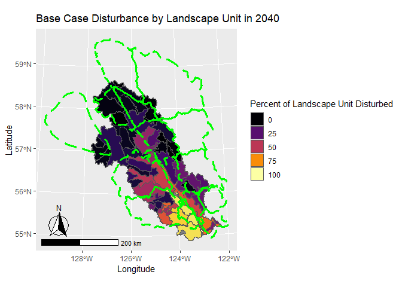<!-- -->

<!-- -->

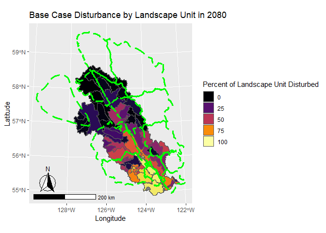<!-- -->

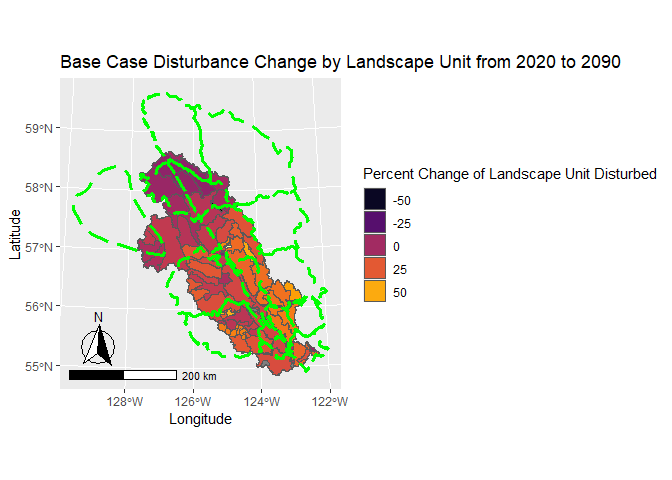<!-- -->

#### Indigenous Alternative Flow 
For the IAF, initially disturbance was highest (>50% to 75%) in landscape units in the central and southern parts of the Mackenzie TSA. These areas overlapped with portions of the Chase, Wolverine, Scott and Kennedy Siding caribou subpopulations. Disturbance amounts remained stable until approximately 2060, when there was an increase in disturbance in landscape units in the central portion of the Wolverine caribou subpopulation range and southern portion of the Graham caribou subpopulation range. From 2020 to 2090, simulated disturbance increased the greatest (approximately 20%) in landscape units in the southern portions of the Mackenzie TSA, areas overlapping the Wolverine and Graham caribou subpopulations. There was relatively little change in simulated disturbance in more northern landscape units in the Mackenzie TSA. 

<!-- -->

<!-- -->

<!-- -->

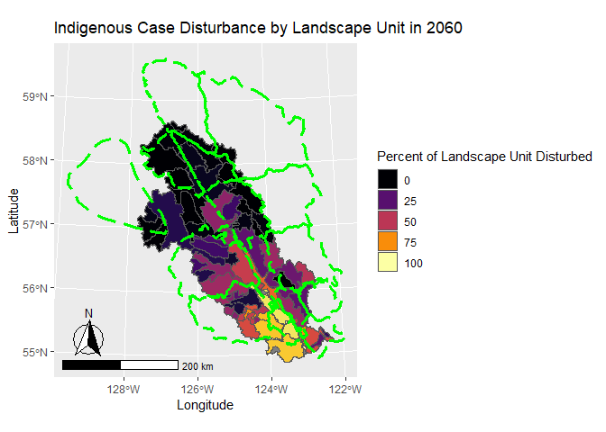<!-- -->

<!-- -->

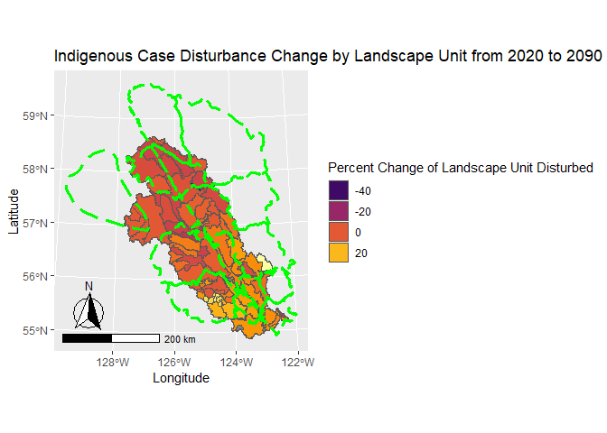<!-- -->

### Disturbance by Watershed Area
Below shows the spatial distribution of disturbance for the two sensitivity analyses at the resolution of a watershed area. Maps of simulated disturbance by watershed area provide a finer spatial resolution of trends in disturbance than landscape units.

#### Base Case
In the BC in 2020, disturbance was relatively high in watersheds in the Scott caribou subpopulation range, western portions of the Kennedy Siding subpopulation range, southeast portions of the Wolverine subpopulation range and south-central portions of the Chase subpopulation range. By 2040, simulated disturbance increased in watersheds in the Scott subpopulation range and northwest portion of the Finlay subpopulation range. By 2060 and 2080, simulated disturbance  increased in watersheds in the Wolverine, Chase and Graham subpopulation ranges. Change in disturbance between 2020 and 2090 was greatest (>50%) in watershed areas overlapping the Kennedy Siding, Scott, Graham and Finlay subpopulation ranges.     
<!-- -->

<!-- -->

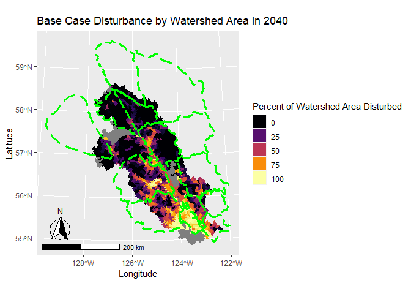<!-- -->

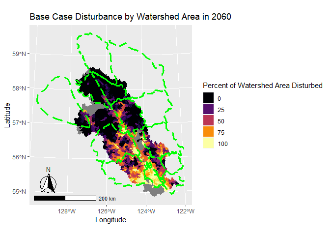<!-- -->

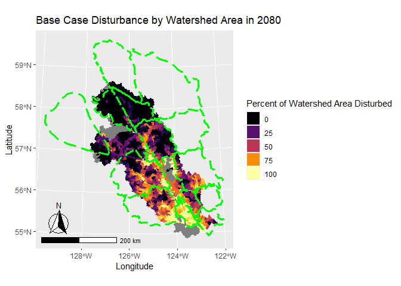<!-- -->

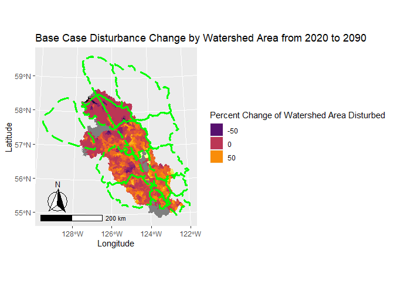<!-- -->

#### Indigenous Alternative Flow 
In the IAF in 2020, disturbance was relatively high in watersheds in the Scott caribou subpopulation range, western portions of the Kennedy Siding subpopulation range, southeast portions of the Wolverine subpopulation range and south-central portions of the Chase subpopulation range. By 2060, simulated disturbance increased in watersheds in the Scott subpopulation range and portions of the Wolverine subpopulation range.  Change in disturbance between 2020 and 2090 was greatest (~50%) in watershed areas overlapping the Scott, Graham and Wolverine subpopulation ranges. 

<!-- -->

<!-- -->

<!-- -->

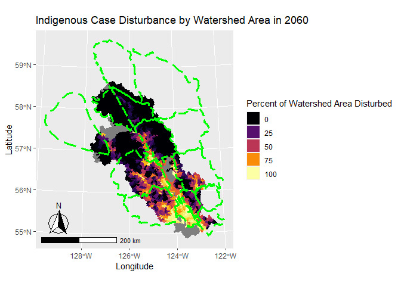<!-- -->

<!-- -->

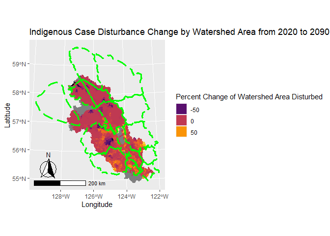<!-- -->

### Critical Habitat Disturbance
Below summarizes the amount of disturbance estimated within each caribou subpopulation habitat type from 2020 to 2090, for each sensitivity analyses.  

#### Central Group
In the critical habitat of the central group of southern mountain caribou that overlapped the Mackenzie TSA (i.e., the Kennedy Siding and Moberly subpopulations), simulated disturbance increased from 2020 to 2090 in all critical habitat types in the BC. However, in the IAF, disturbance only notably increased from 2020 to 2090 in Kennedy Siding high elevation summer range (HESR) and matrix, and Moberly matrix habitat types. 

In the BC, Kennedy Siding low elevation winter range (LEWR) and matrix, and Moberly matrix habitat types had relatively high disturbance throughout the simulation, and increased from 85%, 61% and 56% disturbed, respectively, in 2020 to 96%, 90%  and 90% disturbed, respectively, in 2090. Disturbance in Kennedy Siding HESR, high elevation winter range (HEWR) and Moberly HEWR increased relatively steadily throughout the simulation, from 3%, 8% and 13%, respectively in 2020, to 50%, 50% and 62% in 2090. Disturbance in Moberly HESR and high elevation winter and summer range (HEWSR) remained relatively stable at or below 10% in early parts of the simulation, but increased up to 41% and 27% in 2090.

In the IAF, Kennedy Siding HESR disturbance was stable at approximately 5% disturbance until 2050, then increased to approximately 25% by 2070. Disturbance in Kennedy Siding matrix was stable at approximately 60% until 2050, and then increased to approximately 75% by 2090. Disturbance in Moberly matrix was stable at approximately 55% until 2050, and then increased to approximately 65% by 2090.

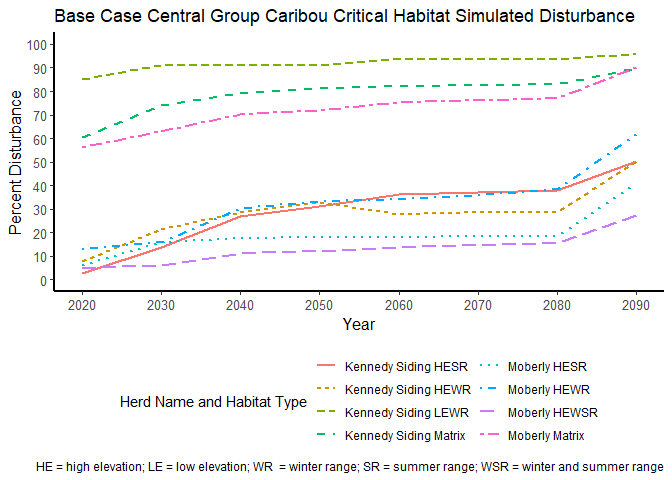<!-- -->

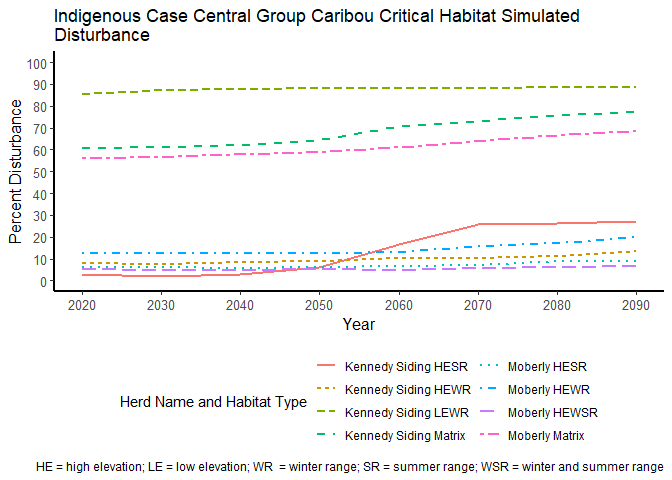<!-- -->

#### Graham
In the critical habitat of the Graham caribou subpopulation that overlapped the Mackenzie timber supply area, simulated disturbance increased from 2020 to 2090 in the BC. From 2020 to 2040, disturbance was relatively high in matrix and HEWSR critical habitat (approximately 25%), and increased steadily up to approximately 65% from 2040 to 2090. Disturbance was relatively low (i.e., 8%) in HESR critical habitat in 2020 but increased steadily to 29% by 2090.

In the IAF, disturbance steadily increased in the HEWSR and Matrix critical habitat from approximately 25% to 45%, and 25% to 35%, respectively, between 2040 and 2090. Disturbance in the HESR critical habitat increased from approximately 8% to 10% between 2040 and 2090. 

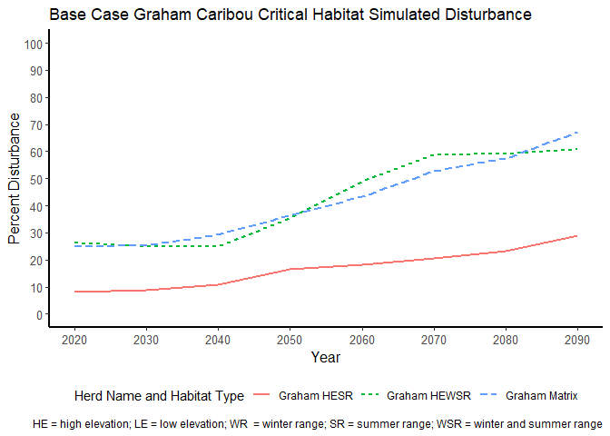<!-- -->

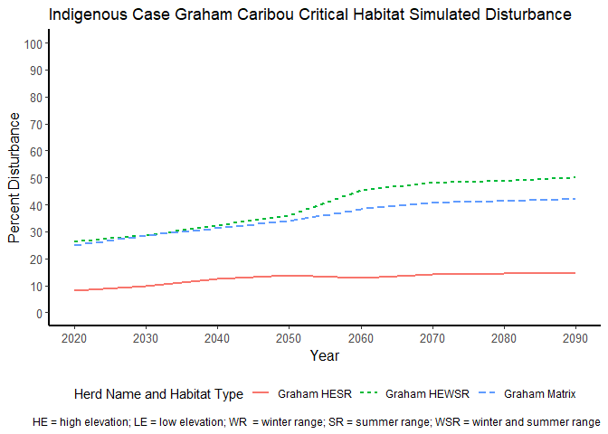<!-- -->

#### Northern Caribou Ranges
##### High Elevation Habitat
At the time of this analysis, critical habitat was not defined for the Frog, Gataga, Muskwa, Pink Mountain, Rabbit and Spatsizi subpopulations, so here we estimate disturbance within their subpopulation ranges at higher (greater than 1,300 m) and lower (less than or equal to 1,300 m) elevations. 

In the BC, disturbance remained relatively low (i.e., <10%) within the high elevation range of most of the subpopulations throughout the simulation period. The exceptions were the Scott subpopulation, which increased from 28% to 58% from 2020 to 2040, the Wolverine subpopulation, which increased from 11% to 32% from 2020 to 2090 and the Chase subpopulation, which increased from 11% to 24% from 2020 to 2090.

In the IAF, disturbance increased in the high elevation range of the Scott subpopulation from 28% to approximately 55% from 2040 to 2060. Disturbance decreased in the Chase high elevation range from approximately 10% to 5% between 2050 and 2060. Disturbance remained less than 10% within the high elevation range of the remainder of the subpopulations throughout the simulation period.

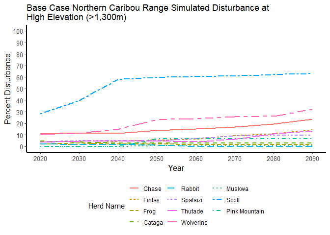<!-- -->

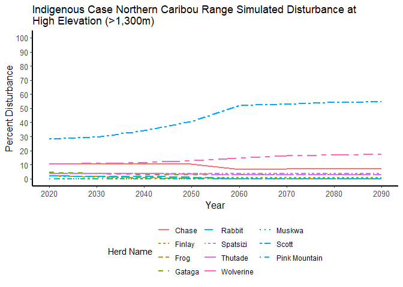<!-- -->

##### Low Elevation Habitat
In the BC, disturbance decreased slightly in low elevations of the Rabbit, Gataga and Frog subpopulation ranges from 2020 to 2090. Disturbance was relatively stable in low elevations of the Muskwa subpopulation range throughout the simulation. Disturbance increased in low elevations of the Spatsizi subpopulation from 20% to 29% between 2020 and 2030. Disturbance increased in low elevations of the Finlay and Thutade subpopulations from ~35% to ~55-65% between 2050 and 2090. Disturbance increased in low elevations of the Chase and Wolverine subpopulations from ~65% to ~80-90% between 2030 and 2090. Disturbance increased in low elevations of the Scott subpopulation from 81% to 98% between 2020 and 2040.

In the IAF, disturbance decreased slightly in low elevations of the Rabbit, Gataga and Frog subpopulation ranges from 2020 to 2090. Disturbance was relatively stable in low elevations of the Chase, Muskwa, Spatsizi, Thutade and Finlay subpopulation range throughout the simulation. Disturbance increased in low elevations of the Wolverine and Scott subpopulation ranges, from approximately 60% to 75% and 80% to 95%, respectively, during the simulation.

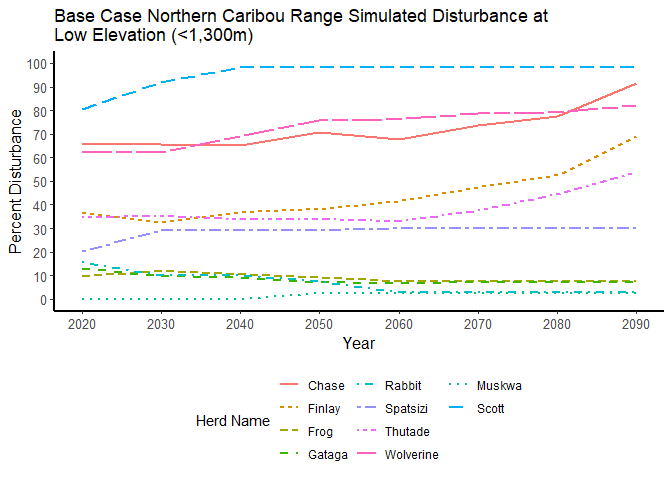<!-- -->

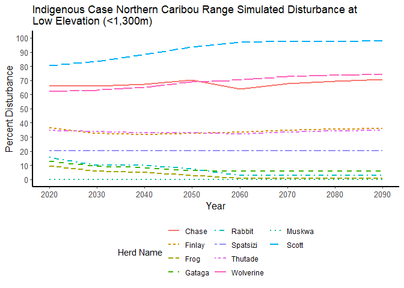<!-- -->

## Conclusions and Considerations
In general in the BC, forestry and fire disturbance as simulated by the Mackenzie timber supply model, increased between 2020 to 2090 across the Mackenzie timber supply area (TSA), suggesting increased loss of habitat and risk to caribou subpopulations in this scenario. The Kennedy Siding, Graham, Chase, Moberly and Finlay subpopulations appeared to be at greatest risk to hypothetical simulated future forestry development in the region in the BC. The IAF resulted in less disturbance in caribou range compared to the BC, suggesting this scenario would result in less loss of habitat and risk of caribou population decline in the region. 

The government of British Columbia has recently (ca. 2015) funded a caribou recovery program to develop and implement policies to sustain and recover caribou populations across the province. This program is in the process of developing habitat protection and restoration policies and actions for caribou that will likely change the trajectories of forestry development simulated in the BC. 

It is important to clarify here that the results of this analysis are based on outputs from a forestry simulation model designed to support a timber supply determination. Efforts were made to parameterize the timber supply model in such a way to simulate current forestry practices at a large scale and account for the effects of those practices to the extent possible in the timber supply assessment. However, such practices are very likely to change in the future in ways that cannot be anticipated. Also important to consider is that we only simulated forestry development and fire with this model, which may underestimate the total amount of current and future disturbance in the area. 

A key assumption of the model described here is that roads, and areas within 500 m of roads, were considered 'permanent' disturbances throughout the simulation period. Thus, as forestry development progressed in the simulation, they established road disturbances that never recovered. This may result in an overestimation of the amount of simulated disturbance in caribou habitat if roads are restored or recovered. However, an assessment of forestry road recovery was outside the scope of this analysis, and thus it's unclear if, or what the rate of recovery is for roads that we could use to parameterize to a model. 

With regard to fire disturbance, it is important to note here that we considered all areas within fire perimeters as burned. In reality, the intensity of burns within these perimeters varies, likely with similar variable effects on the quality of caribou habitat. Estimates of fire disturbance could be fine-tuned to account for fire intensity, however, road and cutblocks made a much larger contribution to disturbance overall.

Finally, it is important to consider that we only simulated forestry disturbance in portions of the caribou habitat areas that overlapped the Mackenzie TSA. Most of the caribou subpopulations only partially overlapped the Mackenzie TSA, and thus hypothetical future disturbance trends across the whole range of a particular subpopulation may be different than what we describe here.
