## Introduction
Here we assess the influence of current and hypothetical simulated future forestry and fire 'disturbance' on caribou habitat in the Mackenzie timber supply area. Caribou are a species of concern to First Nations in the region, and to the governments of British Columbia and Canada. First Nations requested this analysis to assess the potential influence of future forest harvest on caribou as part of the Mackenzie timber supply review.

'Disturbance' is defined here as areas less than 500 m from roads or early seral (less than 40 year old) forestry cutblocks, or areas burned in the last 40 years. These disturbance types have been negatively correlated with caribou survival rates and population abundance across Canada, and therefore are often used to indicate the effects of habitat change caused by forestry and fire on caribou populations. Other disturbance types (e.g., mountain pine beetle infestations or industrial activities like oil and gas or mining development) may also negatively influence caribou, but we do not account for them here. We focus exclusively on fire and forestry because forest management is the scope of the timber supply review and only future forestry and fire are simulated by the timber supply model. In addition, the summary here does not analyze or discuss the potential influence of wildlife population management actions, such as caribou maternity pens or wolf reduction, on caribou populations, as these are outside the scope of a timber supply review.  

## Methods
We obtained simulated forestry and fire disturbance outputs at 10 year intervals over a 70 year period into the future (2020 to 2090) from a SELES/STSM timber supply model. This timber supply model was built and parameterized to inform the Mackenzie timber supply review process, and was capable of simulating and tracking the spatial-temporal occurrence of forestry development and fire. Outputs from the timber supply model used in the analysis here included the location and timing of cutblocks, roads and fires. We buffered simulated roads and less than 40 year old cutblocks by 500m at each decade to estimate the amount of forestry disturbance. Note that the existing roads data had no associated development dates, and we did not estimate a time period for road recovery, therefore all existing roads and relevant simulated future roads were counted as disturbance at each decade. Buffered disturbance was added to the location of less than 40 year old fire disturbances to map the location and estimate the total amount of disturbance for each decade. We then summarized the amount of disturbance in caribou critical habitat, and within [assessment watershed areas](https://catalogue.data.gov.bc.ca/dataset/freshwater-atlas-assessment-watersheds) and [landscape units](https://catalogue.data.gov.bc.ca/dataset/landscape-units-of-british-columbia-current) overlapping critical habitat, by decade, from 2020 to 2090.

## Results
Caribou subpopulation ranges that overlapped the Mackenzie TSA included Kennedy Siding, Moberly, Graham, Frog, Gataga, Muskwa, Pink Mountain, Rabbit, Spatsizi, Finlay, Thutade (not shown), Chase, Wolverine and Scott.  Note that here we refer to each of these as subpopulations, but others may refer to them as herds or populations. Regardless, we use the same naming convention for consistency. 

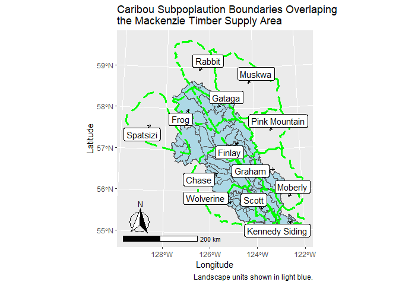<!-- -->

Below we summarize simulated future disturbance levels in caribou critical habitat. We map simulated disturbance estimates in [landscape units](https://catalogue.data.gov.bc.ca/dataset/landscape-units-of-british-columbia-current) and [assessment watershed areas](https://catalogue.data.gov.bc.ca/dataset/freshwater-atlas-assessment-watersheds) in 2020, 2040, 2060 and 2080. We also visualize the proportion of caribou critical habitat areas disturbed over time, from 2020 to 2090. 

### Disturbance by Landscape Unit
Initially, disturbance was highest (>50% to 75%) in landscape units in the central and southern parts of the Mackenzie TSA. These areas overlapped with portions of the Chase, Wolverine, Scott and Kennedy Siding caribou subpopulations. By 2040, simulated disturbance increased further (>75% to 100%) in landscape units in the southern part of the TSA. By 2060 and 2080, simulated disturbance increased further (>50% to 75%) in landscape units in the eastern portions of the Mackenzie TSA, overlapping the Graham caribou subpopulation. From 2020 to 2090, simulated disturbance increased the greatest (>25% to 50%) in landscape units in the east-central portions of the Mackenzie TSA, areas overlapping the Finlay and Graham caribou subpopulations. There was relatively little change in simulated disturbance (<25%) in more northern and western landscape units in the Mackenzie TSA. 

<!-- -->

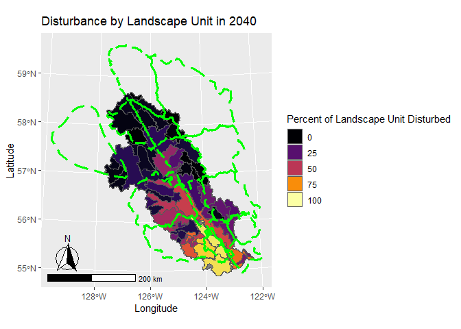<!-- -->

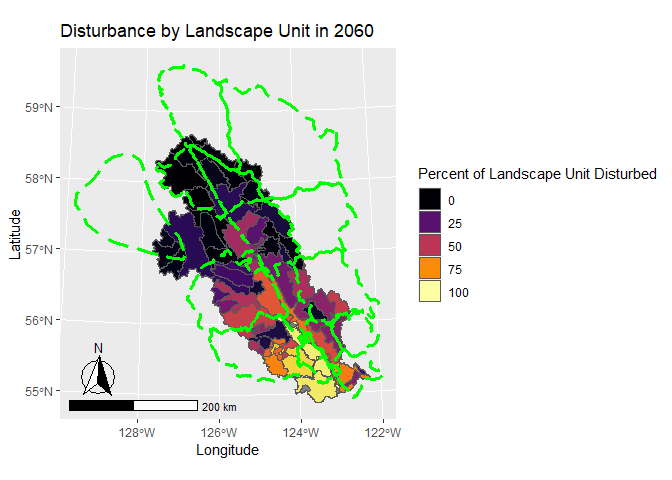<!-- -->

<!-- -->

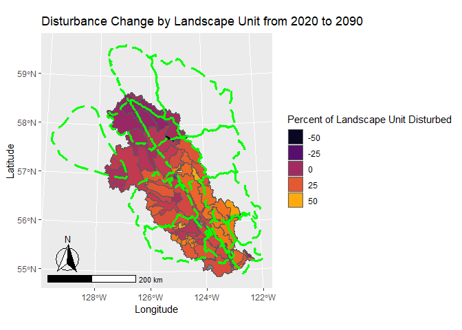<!-- -->

### Disturbance by Watershed Area
Maps of simulated disturbance by watershed area provide a finer spatial resolution than landscape units of trends in disturbance. In 2020, disturbance was relatively high in watersheds in the Scott caribou subpopulation range, western portions of the Kennedy Siding subpopulation range, southeast portions of the Wolverine subpopulation range and south-central portions of the Chase subpopulation range. By 2040, simulated disturbance increased in watersheds in the Scott subpopulation range and northwest portion of the Finlay subpopulation range. By 2060 and 2080, simulated disturbance in watersheds increased in the Wolverine, Chase and Graham subpopulation ranges. Change in disturbance between 2020 and 2090 was greatest (>50%) in watershed areas overlapping the Kennedy Siding, Scott, Graham and Finlay subpopulation ranges.     
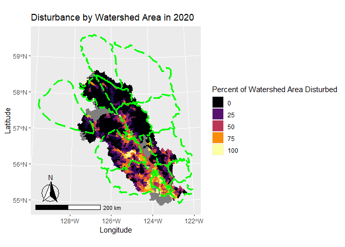<!-- -->

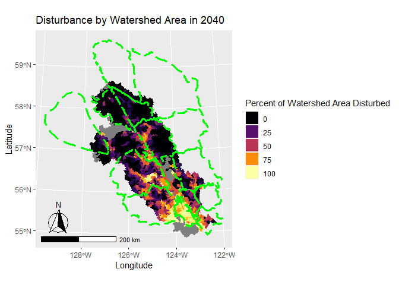<!-- -->

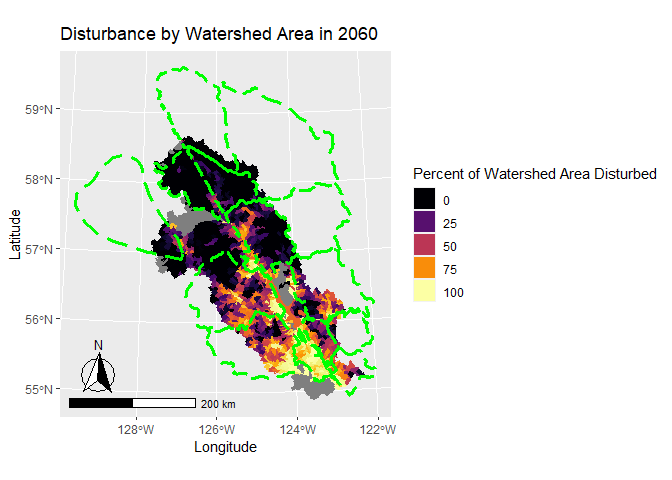<!-- -->

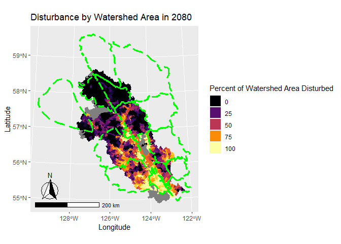<!-- -->

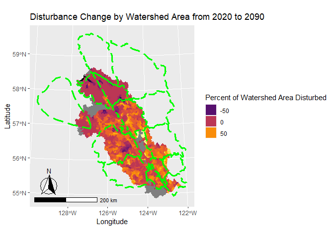<!-- -->

### Critical Habitat Disturbance
In the critical habitat of the central group of southern mountain caribou that overlapped the Mackenzie TSA (i.e., the Kennedy Siding and Moberly subpopulations), simulated disturbance increased from 2020 to 2090. Kennedy Siding low elevation winter range (LEWR) and matrix, and Moberly matrix habitat types had relatively high disturbance throughout the simulation, and increased from 85%, 61% and 56% disturbed, respectively, in 2020 to 96%, 90%  and 90% disturbed, respectively, in 2090. Disturbance in Kennedy Siding high elevation summer range (HESR), high elevation winter range (HEWR) and Moberly HEWR increased relatively steadily throughout the simulation, from 3%, 8% and 13%, respectively in 2020, to 50%, 50% and 62% in 2090. Disturbance in Moberly HESR and high elevation winter and summer range (HEWSR) remained relatively stable at or below 10% in early parts of the simulation, but increased up to 41% and 27% in 2090.

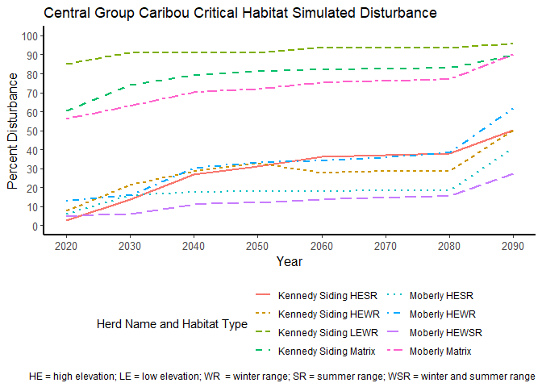<!-- -->

In the critical habitat of the Graham caribou subpopulation that overlapped the Mackenzie timber supply area, simulated disturbance increased from 2020 to 2090. From 2020 to 2040, disturbance was relatively high in matrix and HEWSR critical habitat (approximately 25%), and increased steadily up to approximately 65% from 2040 to 2090. Disturbance was relatively low (i.e., 8%) in HESR critical habitat in 2020 but increased steadily to 29% by 2090.

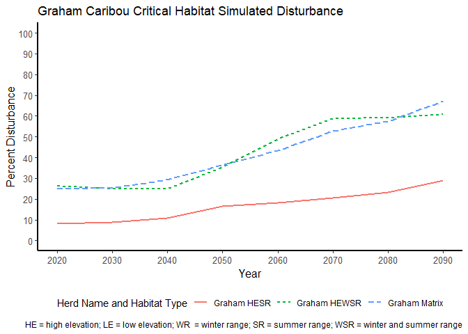<!-- -->

Critical habitat has not been defined for Frog, Gataga, Muskwa, Pink Mountain, Rabbit and Spatsizi subpopulations, so here we estimate disturbance with their ranges. In the ranges of the Frog, Gataga, Muskwa, Pink Mountain, Rabbit and Spatsizi subpopulations that overlapped the Mackenzie TSA, simulated disturbance remained relatively low (i.e., <15%) throughout the simulation period. Disturbance increased in the Finlay (from 16% to 37%) and Thutade (from 12% to 25%) subpopulations throughout the simulation period. Simulated disturbance was relatively high in the Chase, Wolverine and Scott herd ranges throughout the simulation, starting in 2020 from 34%, 43% and 74%, respectively, and increasing to 52%, 63% and 94%, respectively, by 2090.

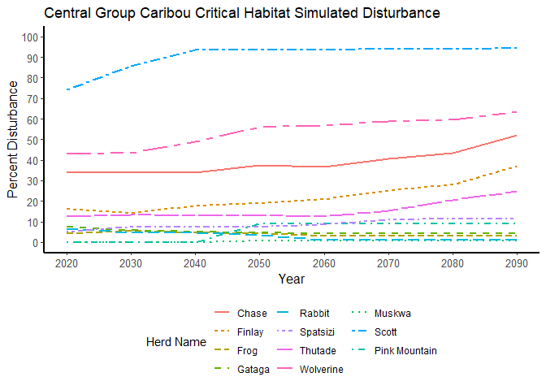<!-- -->

## Conclusions and Considerations
In general, forestry and fire disturbance, as simulated by the Mackenzie timber supply base case model, increased between 2020 to 2090 across the Mackenzie timber supply area (TSA), suggesting increased loss of habitat and risk to caribou subpopulations in this scenario. The Kennedy Siding, Graham, Chase, Moberly and Finlay subpopulations appeared to be at greatest risk to hypothetical simulated future forestry development in the region. The government of British Columbia has recently (ca. 2015) funded a caribou recovery program to develop and implement policies to sustain and recover caribou populations across the province. This program is in the process of developing habitat protection and restoration policies and actions for caribou that will likely change the trajectories of forestry development simulated here. Such actions may also influence timber supply. 

It is important to clarify here that the results of this analysis are based on outputs from a forestry simulation model designed to support a timber supply determination. Forestry was simulated under a single forest harvest scenario (referred to as a 'base case'), that may not occur in reality.  Efforts were made to parameterize the timber supply model in such a way to simulate current forestry practices, but such practices are very likely to change the the future. Thus, the accuracy of the simulation is likely to decrease the further into the future that is being simulated (e.g., the accuracy of outputs from 2020 to 2040 are likely greater than the accuracy of outputs from 2070 to 2090). Also important to consider is that we only simulated forestry development and fire with this model, which may underestimate the total amount of current and future disturbance in the area. 

A key assumption of the model described here is that roads, and areas within 500 m of roads, were considered 'permanent' disturbances throughout the simulation period. Thus, as forestry development progressed in the simulation, they established road disturbances that never recovered. This assumption may result in an overestimation of the amount of simulated disturbance in caribou habitat, as in reality, forestry roads may recover or be restored. Unfortunately, while we can track the timing of road development in the forestry simulation model, the existing road data does not have a date of development. It's also unclear what the rate of recovery is for roads, and this likely varies significantly across road types, and therefore it is difficult to apply a restoration rate to roads.  

With regard to fire disturbance, it is important to note here that we considered all areas within fire perimeters as burned. In reality, the intensity of burns within these perimeters varies, likely with similar variable effects on the quality of caribou habitat. 

Finally, it is important to consider that we only simulated forestry disturbance in portions of the caribou habitat areas that overlapped the Mackenzie TSA. Most of the caribou subpopulations only partially overlapped the Mackenzie TSA, and thus hypothetical future disturbance trends across the whole range of a particular subpopulation may be different than what we describe here.
